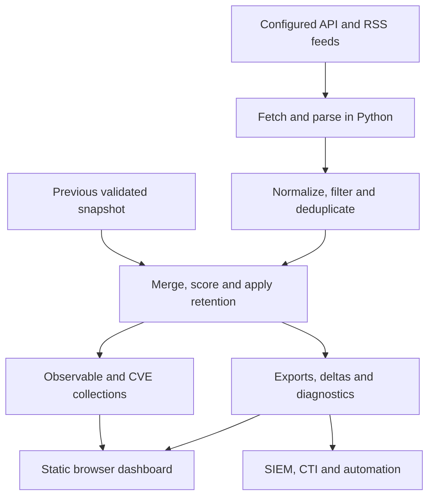

# SwiftIOC

**Public threat feeds, one searchable workspace, and a change stream for security operations.**

[](https://github.com/PKHarsimran/SwiftIOC-Automated-Threat-Intelligence-Collector/actions/workflows/ci.yml)
[](https://github.com/PKHarsimran/SwiftIOC-Automated-Threat-Intelligence-Collector/actions/workflows/codeql.yml)
[](https://github.com/PKHarsimran/SwiftIOC-Automated-Threat-Intelligence-Collector/actions/workflows/collect.yml)
[](LICENSE)

SwiftIOC collects indicators of compromise (IOCs) and vulnerability reports with Python, then publishes a static threat intelligence dashboard and machine-readable feeds. Use it to investigate an IP or domain, follow exploited CVEs affecting products you watch, or bring changes into your own security tools.

**[Open the dashboard](https://harsim.ca/SwiftIOC-Automated-Threat-Intelligence-Collector/) · [Explore CVEs](https://harsim.ca/SwiftIOC-Automated-Threat-Intelligence-Collector/#vulnerabilities) · [Read the latest run report](https://harsim.ca/SwiftIOC-Automated-Threat-Intelligence-Collector/diagnostics/REPORT.md)**

[](https://harsim.ca/SwiftIOC-Automated-Threat-Intelligence-Collector/diagnostics/run.json)
[](https://harsim.ca/SwiftIOC-Automated-Threat-Intelligence-Collector/diagnostics/run.json)
[](https://harsim.ca/SwiftIOC-Automated-Threat-Intelligence-Collector/diagnostics/run.json)

These live badges count records in the **published, retained snapshot**, not the complete upstream catalogs. “Known exploited” means CVEs with CISA KEV evidence; it does not measure attacks happening right now. Badge caching can delay updates. Check [run diagnostics](https://harsim.ca/SwiftIOC-Automated-Threat-Intelligence-Collector/diagnostics/run.json) for source health and coverage.

## Start here

| I want to… | Start with… |
| --- | --- |
| Investigate an indicator without installing anything | [Live dashboard](https://harsim.ca/SwiftIOC-Automated-Threat-Intelligence-Collector/) |
| Prioritize vulnerabilities for products I use | [CVE briefing](#cve-briefing) |
| Run my own collection and dashboard | [Quick start](#quick-start) |
| Import intelligence into a SIEM or CTI platform | [Feeds and integrations](#feeds-and-integrations) |
| Understand where the data and scores come from | [How it works](#how-it-works) and [Scoring and retention](#scoring-and-retention) |
| Schedule collection or publish a fork | [Running continuously](#running-continuously) |
| Add a source or contribute a fix | [Source configuration](#source-configuration) and [Development](#development) |

## How it works

SwiftIOC has two parts: a **Python collector** that produces files and a **browser dashboard** that reads them. Browsing the published site does not require a running Python API, a database server, or an account.



1. **Collect.** YAML selects sources and parsers. Requests run concurrently; diagnostics record source failures and returned volumes.
2. **Normalize.** Parsers turn different feed formats into a shared indicator model. Deduplication uses `(type, indicator)`, retaining source and tag context. Default filtering removes known false positives such as private IPs and example domains.
3. **Maintain the snapshot.** With `--persist-feed`, merge the previous feed, preserve observation history, rescore aging records, and apply configured limits. Without persistence, the snapshot is based on the current collection.
4. **Publish.** Write separate observable and CVE collections, compatibility exports, change events, and run diagnostics.
5. **Investigate or integrate.** The dashboard loads published data; your own tools can consume full snapshots or poll the delta feed.

Two reports about the **same CVE** become one CVE record with separate provider reports. Two different CVE IDs remain separate, even when they share a provider, product, or tag. CVEs are vulnerabilities to investigate and patch; IPs, URLs, domains, and hashes are observables to investigate or match against telemetry.

### What the dashboard adds

| Capability | How it helps |
| --- | --- |
| Search and filters | Narrow indicators by type, source, age, score, and other available context. |
| Discovery lenses | Surface recent sightings and uncommon investigative tags, excluding known feed-name tags. |
| Investigation workspace | Keep selected indicators in a browser-local queue and export a working set. |
| Provider and tag graph | Search displayed nodes by indicator, provider, tag, or raw feed name; inspect every connected node and export the graph or a selected neighborhood as evidence JSON. |
| CVE briefing | Match watched products and distinguish newly encountered records from changed evidence. |
| Diagnostics | Explain missing data, source failures, retention, and the latest collection results. |

The graph groups known aliases under their reporting provider: several abuse.ch exports are one provider, not several independent confirmations. Aggregate and context feeds, such as IPsum and the Tor exit directory, are distinguished from mapped reporting providers. Graph links show shared reporting or tags; they do not establish a threat actor or campaign attribution. Sampling and graph limits can omit relationships.

## CVE briefing

The vulnerability view starts with **Known exploited** when no products are watched. **All CVEs** broadens coverage, while additional views focus on ransomware evidence, recent KEV additions, and recent publication or updates. These dates answer different questions: an old CVE newly added to KEV is not a newly disclosed vulnerability.

**My briefing** makes that collection personal:

1. Add an exact vendor, optionally narrowed to an exact product, from the structured CISA fields.
2. The first matching valid snapshot establishes a baseline without flagging every historical CVE as new.
3. Return to see records **new to your watched collection** and material evidence changes, such as exploitation status, ransomware use, severity, required action, or a due date.
4. Mark an item **Investigating** or **Reviewed**, and export the filtered briefing as JSON with provider reports and triage state.

A routine poll timestamp does not create a new evidence alert. Rejected records remain visible in the watched briefing when needed to explain a status change; other views hide them by default. Invalid or out-of-order snapshots cannot advance the briefing baseline.

Watchlists and review state stay in this browser's local storage. There is no account sync or automatic notification service; blocked storage limits persistence to the current tab. Product matching uses available CISA vendor/product fields, so an NVD-only record without those fields cannot match a watch. Coverage is limited to the retained collection, not an asset inventory or a complete vulnerability assessment.

## Local exposure report

Open **Exposure report** in the CVE section, download the sample JSON, replace
its example values, and import your inventory. Up to 200 assets and 500 KB are
accepted. Inventory stays in memory in the current tab: it is not uploaded,
saved to local storage, or shared with other users. Export the report before
closing the tab if you need to retain it.

Each asset needs a unique `id`, `vendor`, and `product`. Supply `version` for
version checks, `exposure` (`internet`, `internal`, or `unknown`), and
`importance` (`critical` or `standard`) for prioritization. These are your
assertions, not scan results. Optional `cpe_vendor` and `cpe_product` must use
explicit NVD CPE identifiers; `cpe_part` defaults to `a` (application), with
`o` (operating system) and `h` (hardware) also supported. Display names are not
automatically translated into CPE identities.

The report distinguishes **version match**, **needs verification**, and
**outside reported range**. Simple NVD applicability rules support exact
versions and dotted-numeric inclusive/exclusive boundaries. Complex platform
conditions, missing evidence, and unsupported version ordering remain uncertain.
CISA-only product matches cannot confirm affected versions. Older snapshots
without NVD configurations still support product-level review; a new collection
run supplies applicability evidence when NVD provides it.

Reports include provider evidence, matching reasons, remediation, the snapshot
timestamp, and assets without a retained match. No match is not a safety verdict.
The display paginates findings; exports include the whole calculated report,
up to a disclosed 10,000-finding limit. Failed, future, or out-of-order snapshot
refreshes disable the report until usable evidence returns. This first version
is an on-demand assessment, not a scanner, SBOM parser, or change-alert service.

## Quick start

Requires **Python 3.10+** and Git. Run these commands from a terminal.

### macOS or Linux

```bash
git clone https://github.com/PKHarsimran/SwiftIOC-Automated-Threat-Intelligence-Collector.git
cd SwiftIOC-Automated-Threat-Intelligence-Collector
python3 -m venv .venv
source .venv/bin/activate
python -m pip install -e .
cp sources.example.yml sources.yml
python -m swiftioc --self-test
python -m swiftioc --sources sources.yml --out-dir public --persist-feed --max-age-days 30 --max-store 10000
python -m http.server 8765 --directory public
```

### Windows PowerShell

```powershell
git clone https://github.com/PKHarsimran/SwiftIOC-Automated-Threat-Intelligence-Collector.git
Set-Location SwiftIOC-Automated-Threat-Intelligence-Collector
py -3 -m venv .venv
.\.venv\Scripts\python.exe -m pip install -e .
Copy-Item sources.example.yml sources.yml
.\.venv\Scripts\python.exe -m swiftioc --self-test
.\.venv\Scripts\python.exe -m swiftioc --sources sources.yml --out-dir public --persist-feed --max-age-days 30 --max-store 10000
.\.venv\Scripts\python.exe -m http.server 8765 --directory public
```

Open **http://localhost:8765**. Stop the local server with `Ctrl+C`. The collection command makes network requests and can take time; inspect `public/diagnostics/REPORT.md` if a source fails or a collection is empty.

The repository supplies the dashboard HTML and assets in `public/`. The collector writes data into that directory; choosing a different `--out-dir` does not copy the frontend there. Run collection before expecting generated CVE and observable collections to be available locally. `swiftioc` and `python -m swiftioc` are equivalent after installation.

### Docker

```bash
docker build -t swiftioc .
docker volume create swiftioc-data
docker run --rm -v swiftioc-data:/data swiftioc
```

This runs the collector once and keeps output in a named volume. The default command enables persistence, a 30-day age limit, and a 10,000-record cap. The image's health check runs built-in assertions; it is not a feed-freshness check. The container does not serve the dashboard.

To use your configuration on macOS or Linux:

```bash
docker run --rm -v "$PWD/sources.yml:/app/sources.yml:ro" -v swiftioc-data:/data swiftioc
```

## Source configuration

Copy and edit [sources.example.yml](sources.example.yml). Local `sources.yml` is Git-ignored; when it is absent, the collector falls back to the example configuration.

```yaml
window_hours: 48
apis:
  - name: cisa_kev
    kind: json
    parse: kev
    url: https://www.cisa.gov/sites/default/files/feeds/known_exploited_vulnerabilities.json
    reference: https://www.cisa.gov/known-exploited-vulnerabilities-catalog

  - name: nist_nvd_recent
    kind: json
    parse: nvd
    url: https://services.nvd.nist.gov/rest/json/cves/2.0/?resultsPerPage=200
    reference: https://nvd.nist.gov/
    options:
      api_key_env: NVD_API_KEY
```

The optional NVD setting reads the key from the named environment variable. Keep credentials out of committed YAML. Feed availability, authentication requirements, and rate limits depend on the provider; consult diagnostics rather than assuming every configured source succeeded.

Included adapters cover CISA KEV, NVD, abuse.ch feeds, OpenPhish, Spamhaus DROP, SANS ISC/DShield, blocklist.de, GreenSnow, CINS Army, Tor exits, Emerging Threats, Binary Defense, and IPsum. Some are aggregate or contextual sources: membership in a Tor exit list alone does not establish malicious behavior.

Use `options:` for parser-specific arguments, `--source-window name=HOURS` for a per-source lookback, or `parse: universal` for supported JSON, CSV, and text feeds without a dedicated adapter. Custom Python parsers use `parse: my_package.parsers:parse_feed`. RSS extraction is also supported, but blog summaries often contain no usable indicators. See [CONTRIBUTING.md](CONTRIBUTING.md) for parser development.

## Scoring and retention

Scores help rank records; they are not a probability of maliciousness. The current collector starts with a confidence base, adds a source-identifier bonus, and applies exponential decay since `last_seen`:

```text
base = low: 40, medium: 60, high: 80
bonus = 8 per additional source identifier, capped at 16
score = round((base + bonus) × 0.5 ^ (age / half-life)), bounded to 0–100
```

The bonus counts source identifiers, **not verified independent providers**. Provider grouping in the graph is a separate presentation step and does not change that score.

| Indicator type | Score half-life |
| --- | --- |
| URL, IPv4, IPv6 | 7 days |
| Domain | 14 days |
| CIDR, JA3/JA3S, email | 30 days |
| Bitcoin address | 90 days |
| File hash | 180 days |
| CVE | 365 days |

For example, a high-confidence IP from two source identifiers starts at 88 and decays to 44 after seven days without a newer sighting. Source observation timestamps do not necessarily describe attacks happening at that time.

`--persist-feed` carries forward records not seen in the latest fetch. `--min-score` (default 20), `--max-age-days`, and `--max-store` control expiry and capacity. When capped, non-rejected KEV records checked within 24 hours take priority, ordered by newest KEV addition, then other records compete by score and recency. Age/score expiry and finite capacity still limit coverage.

The `high_confidence` feed includes records at or above the threshold (default 80) **or with at least two source identifiers**. Review provenance, age, and local context before using any feed for blocking. Use the observable collection when an integration must exclude CVE IDs.

## Investigation queue SPL

Adding observables to the investigation queue automatically builds a copyable Splunk hunt for those selected values. The query updates on removal and supports IPs/CIDRs, exact DNS domains, full URLs, and MD5/SHA-1/SHA-256. Unsupported entries are listed explicitly; an empty supported selection disables export. Set your index and time range beside the live query, then expand **Map event fields** to match your extracted fields (including dotted names such as `source.ip`). These settings remain in memory until the page reloads; changing the queue preserves them. Invalid settings clear the query and disable copying/downloading until corrected. Use one index name and single-valued event fields; the builder supports letters, numbers, underscores and dots in field names, with a leading letter or underscore. Results retain all matching queued IOC identities. This is a bounded triage query; use the lookup-based Splunk library for full-feed matching. Validate execution in your own Splunk deployment.

## Feeds and integrations

**[Splunk hunt library](https://harsim.ca/SwiftIOC-Automated-Threat-Intelligence-Collector/splunk/)** — copy-ready SPL for source/destination IPs, exact DNS domains, SHA-256 hashes, and exact URLs, with lookup preparation and field-mapping instructions.

Paths below are relative to the published site or your `--out-dir`.

| Output | Contents and intended use |
| --- | --- |
| [`collections/observables.jsonl`](https://harsim.ca/SwiftIOC-Automated-Threat-Intelligence-Collector/collections/observables.jsonl) | Non-CVE indicators for matching against telemetry. |
| [`collections/vulnerabilities.json`](https://harsim.ca/SwiftIOC-Automated-Threat-Intelligence-Collector/collections/vulnerabilities.json) | One record per CVE with separate provider reports and exploitation evidence. |
| [`iocs/latest.jsonl`](https://harsim.ca/SwiftIOC-Automated-Threat-Intelligence-Collector/iocs/latest.jsonl) | Full retained snapshot, including CVEs; also available as CSV, TSV, and JSON. |
| [`iocs/high_confidence.jsonl`](https://harsim.ca/SwiftIOC-Automated-Threat-Intelligence-Collector/iocs/high_confidence.jsonl) | Threshold/multi-source subset; also available as CSV. |
| `iocs/dashboard.jsonl` | Compact dashboard preview, default 1,000 rows; not the full feed. |
| [`iocs/delta.json`](https://harsim.ca/SwiftIOC-Automated-Threat-Intelligence-Collector/iocs/delta.json) and `delta.jsonl` | Additions, removals, and material updates since the previous validated snapshot. |
| `iocs/stix2.json` | STIX 2.1 bundle for compatible tooling. |
| `iocs/taxii2-envelope.json` | Static TAXII 2.1 envelope; this is not a TAXII API server. |
| [`misp/manifest.json`](https://harsim.ca/SwiftIOC-Automated-Threat-Intelligence-Collector/misp/manifest.json) and event files | MISP feed for repeatable imports. |
| `detections/` | Generated detection packs; review and adapt to your environment. |
| [`feed.xml`](https://harsim.ca/SwiftIOC-Automated-Threat-Intelligence-Collector/feed.xml) | RSS feed for recent high-confidence records. |
| `diagnostics/run.json` and `diagnostics/REPORT.md` | Machine-readable source/run results and a readable report. |
| `badge.json` | Live snapshot count and update timestamp for Shields endpoint badges. |

### Consume changes safely

Start with the full snapshot for initial synchronization, then poll the delta feed. An unavailable or invalid previous snapshot establishes a baseline without emitting a historical additions flood. The browser's personal briefing baseline is separate from this collector baseline.

An `added` event means new to the retained feed; it does not prove the indicator was just created. A `removed` event means absent from the current snapshot, not benign. Material score and vulnerability-report changes produce `updated` events; a changed polling timestamp alone does not. A delta describes one collection interval, so consumers that miss runs should reconcile against the full snapshot.

See [integration examples](integrations/README.md) for Splunk, Elastic Security, Microsoft Sentinel, and detection guidance. For retained Git history, [build_history_index.py](scripts/build_history_index.py) and [ioc_timeline.py](scripts/ioc_timeline.py) support indicator timeline investigations.

## Running continuously

The repository's [collection workflow](.github/workflows/collect.yml) is scheduled every four hours and can be run manually. It collects data, persists the feed, writes diagnostics and summaries, and publishes the site. Scheduled execution can be delayed; check the latest run and data timestamps instead of treating the schedule as a freshness guarantee.

For your own fork:

1. Review the source configuration and collection flags in the workflow.
2. Enable GitHub Actions and configure GitHub Pages to deploy through Actions.
3. Set your own public URL with `--site-url` where appropriate and configure any required provider credentials as secrets.
4. Run collection manually, inspect diagnostics, and confirm the generated collections load on your published site.

For a workstation, server, or another CI system, schedule the collector command from the quick start. Keep the output directory between runs for persistence and deltas, and prevent overlapping runs against the same directory. Publishing `public/` serves both the existing frontend and generated files.

### Check the collection, not just the website

An available static site can still contain stale data. Use source diagnostics and the collection workflow status together. Options include `--fail-on-empty name`, `--fail-if-stale name=HOURS` (based on newest `first_seen`), and `--warn-if-volume-drop name=PERCENT`. Save raw responses with `--save-raw-dir` when investigating parser failures.

Generate the readable IOC summary manually with:

```bash
python scripts/summarize_iocs.py --diag public/diagnostics/run.json --ioc-jsonl public/iocs/latest.jsonl
```

### Troubleshooting

| Symptom | Check |
| --- | --- |
| Local dashboard cannot load data | Serve `public/` over HTTP and run collection first; do not open `index.html` as a local file. |
| CVEs are unavailable in a fresh checkout | Generate `collections/vulnerabilities.json`; generated collections may not be committed. |
| A source has no results | Read its diagnostics for HTTP errors, rate limits, parser problems, or a genuinely empty window. |
| Fewer records than the upstream catalog | Check lookback, filtering, score expiry, age limits, and the storage cap. |
| My watched product has no CVEs | Check exact vendor/product spelling and whether the retained records have structured CISA fields. |
| Review state disappears | Check browser storage settings; local state does not follow you to another browser or device. |
| The graph shows fewer providers than raw feeds | Known aliases share a provider; context/aggregate feeds and sampling are handled separately. |

## CLI reference

Run `python -m swiftioc --help` for the installed version's options.

<details>
<summary>Expand collection, retention, diagnostics, and export options</summary>

| Flag | Purpose |
| --- | --- |
| `--out-dir PATH` | Directory where artifacts are written (`public/` by default). |
| `--sources PATH` | YAML configuration (`sources.yml`, falls back to `sources.example.yml`). |
| `--window-hours N` | Global lookback window in hours. |
| `--skip-rss` | Disable RSS processing entirely. |
| `--max-per-source N` | Cap the number of indicators taken from each source. |
| `--max-workers N` | Number of sources fetched concurrently (default `8`; use `1` to disable threading). |
| `--no-fp-filter` | Disable bogon / false-positive filtering (keep private IPs, `example.com`, etc.). |
| `--persist-feed` | Living feed: merge the previously published `latest.jsonl`, decay scores by age, expire stale entries. |
| `--min-score N` | Expire indicators whose decayed score falls below `N` (default `20`). |
| `--high-confidence-score N` | Score at/above which an indicator enters the curated `high_confidence` feed (default `80`; multi-source indicators always qualify). |
| `--max-age-days N` | Retention: drop indicators whose `last_seen` is older than `N` days. |
| `--max-store N` | Retention: keep at most `N`; non-rejected KEV entries checked within 24 hours take priority (newest catalog additions first), then other records by score/recency. |
| `--dashboard-rows N` | Rows in the compact `dashboard.jsonl` the web dashboard downloads (default `1000`). |
| `--site-url URL` | Public site URL used as the RSS `<link>` (override for forks/custom domains). |
| `--rss-limit N` | Number of items in `feed.xml` (default `50`). |
| `--no-misp-feed` | Disable writing the MISP feed directory. |
| `--urlhaus-status {any,online,offline}` | Filter URLhaus indicators by status. |
| `--source-window name=N` | Override the lookback window for specific sources. |
| `--grace-on-404 name` | Treat HTTP 404 for listed sources as a non-fatal empty result. |
| `--fail-on-empty name…` | Fail the run if any listed sources return zero indicators. |
| `--fail-if-stale name=N` | Fail when the newest `first_seen` from `name` is older than `N` hours. |
| `--warn-if-volume-drop name=N` | Warn when a source returns at least `N` percent fewer rows than the prior run. |
| `--save-raw-dir PATH` | Persist raw feed responses for later inspection. |
| `--diag-json PATH` | Write diagnostics JSON (defaults to `<out-dir>/diagnostics/run.json`). |
| `--report PATH` | Write Markdown run report (defaults to `<out-dir>/diagnostics/REPORT.md`). |
| `--ua-file PATH` | Provide a custom user-agent pool (one UA per line). |
| `--ci-safe` | Convenience flag for CI runs (JSON logs, ensures diagnostics dirs, tolerates missing RSS dependency). |
| `--self-test` | Execute built-in assertions without fetching feeds. |
| `-v/--verbose` | Increase console logging (`-vv` for debug). |
| `--log-file PATH` | Send logs to a file. |
| `--log-format {text,json}` | Choose console/file log format. |
| `--log-file-level LEVEL` | Control the file log level (default `DEBUG`). |

</details>

## Development

The core code lives in [`swiftioc/`](swiftioc/), the static frontend in [`public/assets/`](public/assets/), Python regression tests in [`tests/`](tests/), and operational/browser helpers in [`scripts/`](scripts/).

After the quick-start installation:

```bash
python -m pip install -r requirements-dev.txt
ruff check .
pyright
python -m swiftioc --self-test
pytest -q
node --test public/assets/dashboard-core.test.js public/assets/inventory-core.test.js
```

Python tests mock network calls. The frontend core suite checks data logic with Node.js. For browser regressions, install Playwright and serve the site:

```bash
npm install --no-save --package-lock=false playwright
npx playwright install chromium
python -m http.server 8765 --directory public
```

In a second terminal:

```bash
node scripts/test_vulnerability_ui.cjs
node scripts/test_dashboard_layout.cjs
node scripts/test_personal_briefing.cjs
node scripts/test_inventory_ui.cjs
```

These suites use synthetic fixtures to exercise filtering, refresh failures, mobile layout, personal briefing state, and provider graph behavior. Set `BASE_URL` for a different local server or `PLAYWRIGHT_CHROMIUM_EXECUTABLE_PATH` for an existing Chromium browser.

Read [CONTRIBUTING.md](CONTRIBUTING.md) before submitting a parser or feature. Report vulnerabilities through [SECURITY.md](SECURITY.md). SwiftIOC is distributed under the [MIT license](LICENSE); upstream feeds retain their own terms and attribution requirements.
