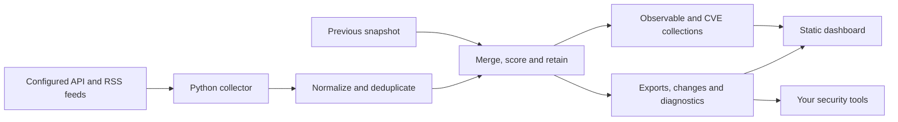
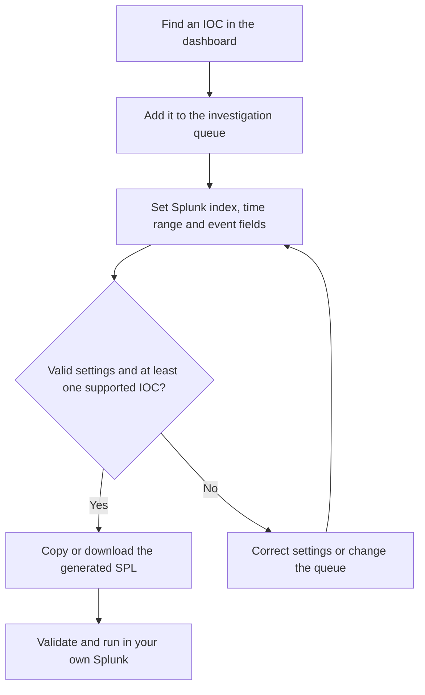
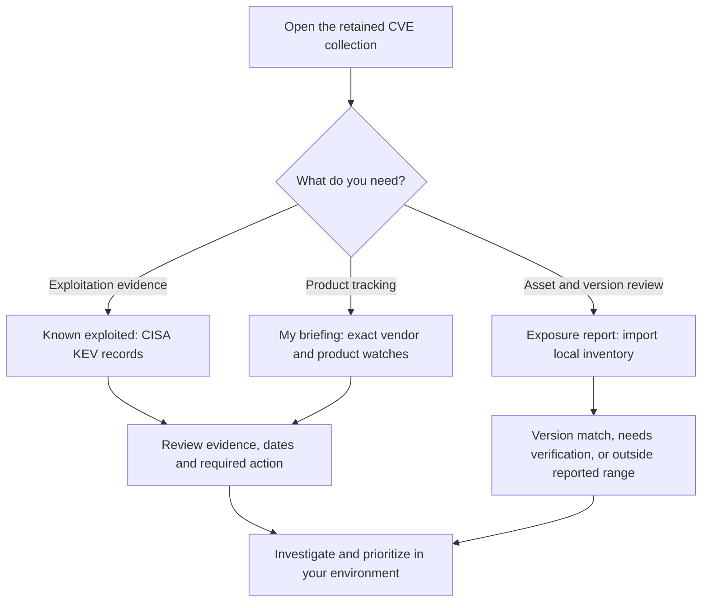
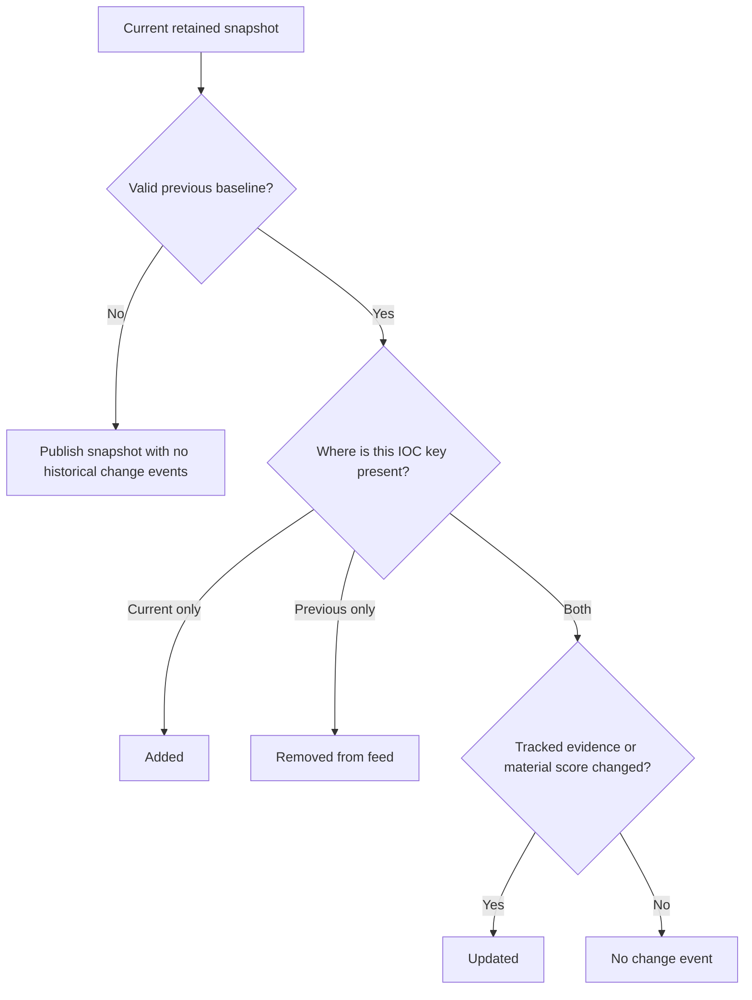

# SwiftIOC

**Collect threat intelligence. Understand the evidence. Take a focused working set into your security tools.**

SwiftIOC is an open-source **Python collector and browser dashboard** for indicators of compromise (IOCs) and vulnerability reports. An IOC is an observable—such as an IP address, domain, URL, or file hash—that can help an analyst investigate suspicious activity.

A CVE ID identifies a publicly cataloged vulnerability; an IOC identifies something to look for in telemetry. The collector turns public feeds into consistent files. The dashboard makes those files searchable and helps you move from a suspicious indicator or exploited CVE to evidence, a shortlist, and a usable export.

**[Try the live dashboard](https://harsim.ca/SwiftIOC-Automated-Threat-Intelligence-Collector/) · [Known exploited CVEs](https://harsim.ca/SwiftIOC-Automated-Threat-Intelligence-Collector/#vulnerabilities) · [Splunk hunt library](https://harsim.ca/SwiftIOC-Automated-Threat-Intelligence-Collector/splunk/) · [Collection diagnostics](https://harsim.ca/SwiftIOC-Automated-Threat-Intelligence-Collector/diagnostics/summary.html)**

[](https://github.com/PKHarsimran/SwiftIOC-Automated-Threat-Intelligence-Collector/actions/workflows/ci.yml)
[](https://github.com/PKHarsimran/SwiftIOC-Automated-Threat-Intelligence-Collector/actions/workflows/codeql.yml)
[](https://github.com/PKHarsimran/SwiftIOC-Automated-Threat-Intelligence-Collector/actions/workflows/collect.yml)
[](LICENSE)

### Live snapshot

[](https://harsim.ca/SwiftIOC-Automated-Threat-Intelligence-Collector/diagnostics/run.json)

[](https://harsim.ca/SwiftIOC-Automated-Threat-Intelligence-Collector/diagnostics/run.json)
[](https://harsim.ca/SwiftIOC-Automated-Threat-Intelligence-Collector/diagnostics/run.json)
[](https://harsim.ca/SwiftIOC-Automated-Threat-Intelligence-Collector/diagnostics/run.json)

These badges read the published data; counts are **retained records, not complete upstream catalogs**. “Known exploited” means CISA Known Exploited Vulnerabilities (KEV) evidence, not an attack happening right now. Badges may be cached; use the linked diagnostics for timestamps and source failures.

<details>
<summary><strong>What changed in the latest collection?</strong></summary>

[](https://harsim.ca/SwiftIOC-Automated-Threat-Intelligence-Collector/diagnostics/run.json)
[](https://harsim.ca/SwiftIOC-Automated-Threat-Intelligence-Collector/diagnostics/run.json)
[](https://harsim.ca/SwiftIOC-Automated-Threat-Intelligence-Collector/diagnostics/run.json)

Changes compare the latest snapshot with its validated baseline. Removed means absent from the retained feed, not safe. A first run has no historical alert flood. [Read the change feed](https://harsim.ca/SwiftIOC-Automated-Threat-Intelligence-Collector/iocs/delta.json) or learn [how to consume it](#consume-changes-safely).

</details>

## Start here

| Your goal | Fastest path |
| --- | --- |
| Investigate an IP, domain, URL, or hash | [Open the dashboard](https://harsim.ca/SwiftIOC-Automated-Threat-Intelligence-Collector/); no installation or account needed. |
| Work through exploited vulnerabilities | [CVE briefing](#cve-briefing), with optional product watches and a local exposure report. |
| Hunt selected IOCs in Splunk | [Investigation workspace](#investigation-workspace): queue → configure → copy SPL. |
| Run the collector yourself | [Quick start](#quick-start) for macOS, Linux, Windows, or Docker. |
| Connect a SIEM or threat intelligence platform | [Feeds and integrations](#feeds-and-integrations). |
| Add a source or contribute a fix | [Source configuration](#source-configuration) and [Development](#development). |

## What you can do

| Workflow | What SwiftIOC provides |
| --- | --- |
| **Look up and triage** | Search ordinary or defanged IOCs, then filter by type, source, age, and score. Defanging replaces characters such as `.` with `[.]` so an indicator is less likely to be opened accidentally. |
| **Find leads** | Discovery lenses surface recent sightings and uncommon investigative tags while excluding known feed-name aliases. |
| **Follow the evidence** | A provider/tag graph groups source aliases, highlights connected records, and exports the displayed graph or selected neighborhood. Click empty graph space or press Escape to clear selection. |
| **Build a hunt** | Keep up to 50 IOCs in a local investigation queue, generate SPL, and export CSV, JSON, Sigma, or Suricata output where supported. |
| **Prioritize CVEs** | Review exploitation evidence, dates, remediation, personal product watches, and imported inventory matches. |
| **Operate the pipeline** | Consume snapshot/delta feeds and inspect source failures, filtering, retention, and volume in diagnostics. |

> **Know what the evidence means.** Scores rank relevance; they are not probabilities. Shared reporting or tags do not establish a campaign or threat actor. A missing IOC or CVE does not prove an asset is safe. SwiftIOC is a collection and investigation tool, not a scanner or a managed detection service.

## How it works

Two parts, one file-based interface: **Python collects and publishes; the browser reads and investigates.** The dashboard needs no Python API, database server, or account system.



1. **Fetch:** YAML selects sources and parsers; diagnostics record failures and returned volumes.
2. **Normalize:** turn different formats into a shared indicator model, remove configured false positives, and deduplicate by `(type, indicator)`.
3. **Maintain:** with `--persist-feed`, carry forward prior records, preserve history, rescore aging evidence, and apply retention limits. Without it, the output uses the current collection.
4. **Publish:** write separate observable and CVE collections, compatibility feeds, change events, and diagnostics.

Reports about the **same CVE** share one record with separate provider evidence. **Different CVE IDs remain separate**, even if they share a product, source, or tag. CVEs describe vulnerabilities; observables are values you can match against telemetry.

The graph groups known aliases under their reporting provider: several abuse.ch exports do not count as independent providers. Aggregate/context feeds such as IPsum and Tor are distinguished from reporting providers. The graph is a bounded sample and can omit relationships.

<a id="investigation-queue-spl"></a>

## Investigation workspace



The browser builds the query; it does not connect to or run searches in Splunk. Unsupported queued records are disclosed and excluded from the query.

1. **Queue indicators** while browsing the feed, lookup results, or graph.
2. **Open Workspace** from the floating shortcut. **Back to results** returns to your earlier scroll position.
3. **Configure the live SPL (Splunk search):** choose an index and time range, then expand **Map event fields** if your logs use names such as `source.ip`.
4. **Copy or export:** the query updates with the queue and lists every matching queued IOC in each result. Other export buttons produce the selected working set.
5. **Recover mistakes:** **Undo last change** restores the prior queue after an addition, import, removal, or clear, including its order and generated SPL.

**CVE-only queues show a software-verification checklist instead of SPL controls.** Use **Review evidence** beside a queued CVE to search for its exact ID across all statuses, including rejected records. CVE IDs are excluded from IOC SPL; mixed queues still generate searches for supported observables. Use the exposure report to compare installed vendor/product/version evidence, then confirm applicability with vendor guidance or scanner results. Splunk can support this only when your own inventory or scanner telemetry is available.

The dashboard’s **Get started or resume an investigation** guide links directly to IOC lookup, CVE evidence, the exposure report and product watches.

**Resume saved work:** choose **Export JSON** in Workspace. Later, open **Get started or resume an investigation → Resume a saved investigation** and select that file (up to 500 KB). Import merges with your current queue, preserves existing evidence for duplicates, and keeps URL paths case-sensitive. Invalid or over-capacity files leave the queue unchanged. One Undo restores the entire previous queue; duplicate-only imports preserve your existing Undo step. Files are read locally and are not uploaded.

The queue holds **50 indicators**. It reports save failures, offers **Retry save**, and shows remaining capacity. Export your work before leaving if storage is unavailable. Undo retains one step in page memory and resets on reload.

<details>
<summary><strong>Supported SPL, field mapping, and privacy details</strong></summary>

SPL supports IPs/CIDRs, exact DNS domains, full URLs, and MD5/SHA-1/SHA-256 hashes. Unsupported records are listed; no supported IOCs or invalid settings disables query export. Use one index and extracted, single-valued fields. Field names must start with a letter or underscore and use letters, numbers, underscores, or dots.

Hunt settings stay in memory until reload; queue changes preserve them. Generated searches must be validated in your Splunk deployment. For full-feed matching, use the [lookup-based Splunk library](https://harsim.ca/SwiftIOC-Automated-Threat-Intelligence-Collector/splunk/).

| Data | Where it stays |
| --- | --- |
| Investigation queue | This browser's local storage when saving succeeds; no account/device sync. |
| Undo and SPL settings | Current page memory, cleared on reload. |
| Product watches and review state | This browser's local storage when available. |
| Imported asset inventory | Current tab memory only; not uploaded or saved to local storage. |

The dashboard fetches public feeds; it does not upload your queue or inventory. Exported files contain the working set or inventory report you requested and should be handled accordingly.

</details>

## CVE briefing

The vulnerability view starts with **Known exploited** when no products are watched. **All CVEs** broadens coverage, while additional views focus on ransomware evidence, recent KEV additions, and recent publication or updates. These dates answer different questions: an old CVE newly added to KEV is not a newly disclosed vulnerability.

<details>
<summary><strong>How to choose a CVE workflow</strong></summary>



KEV inclusion is evidence of known exploitation. An NVD severity score describes severity, not proof of exploitation. Inventory matching is an evidence comparison; it does not scan your assets. All three paths use the retained collection.

</details>

**My briefing** supports up to 20 product watches and makes that collection personal:

1. Add an exact vendor, optionally narrowed to an exact product, from the structured CISA fields.
2. The first matching valid snapshot establishes a baseline without flagging every historical CVE as new.
3. Return to see records **new to your watched collection** and material evidence changes, such as exploitation status, ransomware use, severity, required action, or a due date.
4. Mark an item **Investigating** or **Reviewed**, and export the filtered briefing as JSON with provider reports and triage state.

A routine poll timestamp does not create a new evidence alert. Rejected records remain visible in the watched briefing when needed to explain a status change; other views hide them by default. Invalid or out-of-order snapshots cannot advance the briefing baseline. The browser retains at most 5,000 baseline records; narrow vendor/product watches if the interface reports this limit.

Watchlists and review state stay in this browser's local storage. There is no account sync or automatic notification service; blocked storage limits persistence to the current tab. Product matching uses available CISA vendor/product fields, so an NVD-only record without those fields cannot match a watch. Coverage is limited to the retained collection. For explicit asset/version checks, use the local exposure report below; neither view is a complete vulnerability assessment.

## Local exposure report

Import a JSON inventory in the CVE section to compare up to **200 assets / 500 KB** against retained CISA and NVD evidence. Results distinguish **version match**, **needs verification**, and **outside reported range**. This is an on-demand evidence comparison, not a scan.

<details>
<summary><strong>Inventory format, version matching, and report limits</strong></summary>

Open **Exposure report** in the CVE section, download the sample JSON, replace
its example values, and import your inventory. Up to 200 assets and 500 KB are
accepted. Inventory stays in memory in the current tab: it is not uploaded,
saved to local storage, or shared with other users. Export the report before
closing the tab if you need to retain it.

Each asset needs a unique `id`, `vendor`, and `product`. Supply `version` for
version checks, `exposure` (`internet`, `internal`, or `unknown`), and
`importance` (`critical` or `standard`) for prioritization. These are your
assertions, not scan results. Optional `cpe_vendor` and `cpe_product` must use
explicit NVD CPE identifiers; `cpe_part` defaults to `a` (application), with
`o` (operating system) and `h` (hardware) also supported. Display names are not
automatically translated into CPE identities.

The report distinguishes **version match**, **needs verification**, and
**outside reported range**. Simple NVD applicability rules support exact
versions and dotted-numeric inclusive/exclusive boundaries. Complex platform
conditions, missing evidence, and unsupported version ordering remain uncertain.
CISA-only product matches cannot confirm affected versions. Older snapshots
without NVD configurations still support product-level review; a new collection
run supplies applicability evidence when NVD provides it.

Reports include provider evidence, matching reasons, remediation, the snapshot
timestamp, and assets without a retained match. No match is not a safety verdict.
The display paginates findings; exports include the whole calculated report,
up to a disclosed 10,000-finding limit. Failed, future, or out-of-order snapshot
refreshes disable the report until usable evidence returns. This first version
is an on-demand assessment, not a scanner, SBOM parser, or change-alert service.

</details>

## Quick start

Requires **Python 3.10+** and Git. Run these commands from a terminal.

### macOS or Linux

```bash
git clone https://github.com/PKHarsimran/SwiftIOC-Automated-Threat-Intelligence-Collector.git
cd SwiftIOC-Automated-Threat-Intelligence-Collector
python3 -m venv .venv
source .venv/bin/activate
python -m pip install -e .
cp sources.example.yml sources.yml
python -m swiftioc --self-test
python -m swiftioc --sources sources.yml --out-dir public --persist-feed --max-age-days 30 --max-store 10000
python -m http.server 8765 --directory public
```

<details>
<summary id="windows-powershell"><strong>Windows PowerShell commands</strong></summary>

```powershell
git clone https://github.com/PKHarsimran/SwiftIOC-Automated-Threat-Intelligence-Collector.git
Set-Location SwiftIOC-Automated-Threat-Intelligence-Collector
py -3 -m venv .venv
.\.venv\Scripts\python.exe -m pip install -e .
Copy-Item sources.example.yml sources.yml
.\.venv\Scripts\python.exe -m swiftioc --self-test
.\.venv\Scripts\python.exe -m swiftioc --sources sources.yml --out-dir public --persist-feed --max-age-days 30 --max-store 10000
.\.venv\Scripts\python.exe -m http.server 8765 --directory public
```


</details>

Open **[localhost:8765](http://localhost:8765)**. Stop the local server with `Ctrl+C`. The collection command makes network requests and can take time; inspect `public/diagnostics/REPORT.md` if a source fails or a collection is empty.

The repository supplies the dashboard HTML and assets in `public/`. The collector writes data into that directory; choosing a different `--out-dir` does not copy the frontend there. Run collection before expecting generated CVE and observable collections to be available locally. `swiftioc` and `python -m swiftioc` are equivalent after installation.

<details>
<summary id="docker"><strong>Run the collector with Docker</strong></summary>

```bash
docker build -t swiftioc .
docker volume create swiftioc-data
docker run --rm -v swiftioc-data:/data swiftioc
```

This runs the collector once and keeps output in a named volume. The default command enables persistence, a 30-day age limit, and a 10,000-record cap. The image's health check runs built-in assertions; it is not a feed-freshness check. The container does not serve the dashboard.

To use your configuration on macOS or Linux:

```bash
docker run --rm -v "$PWD/sources.yml:/app/sources.yml:ro" -v swiftioc-data:/data swiftioc
```

</details>

## Feeds and integrations

**[Splunk hunt library](https://harsim.ca/SwiftIOC-Automated-Threat-Intelligence-Collector/splunk/)** — copy-ready SPL for source/destination IPs, exact DNS domains, SHA-256 hashes, and exact URLs, with lookup preparation and field-mapping instructions.

Paths below are relative to the published site or your `--out-dir`.

| Output | Contents and intended use |
| --- | --- |
| [`collections/observables.jsonl`](https://harsim.ca/SwiftIOC-Automated-Threat-Intelligence-Collector/collections/observables.jsonl) | Non-CVE indicators for matching against telemetry. |
| [`collections/vulnerabilities.json`](https://harsim.ca/SwiftIOC-Automated-Threat-Intelligence-Collector/collections/vulnerabilities.json) | One record per CVE with separate provider reports and exploitation evidence. |
| [`iocs/latest.jsonl`](https://harsim.ca/SwiftIOC-Automated-Threat-Intelligence-Collector/iocs/latest.jsonl) | Full retained snapshot, including CVEs; also available as CSV, TSV, and JSON. |
| [`iocs/high_confidence.jsonl`](https://harsim.ca/SwiftIOC-Automated-Threat-Intelligence-Collector/iocs/high_confidence.jsonl) | Threshold/multi-source subset; also available as CSV. |
| `iocs/dashboard.jsonl` | Compact dashboard preview, default 1,000 rows; not the full feed. |
| [`iocs/delta.json`](https://harsim.ca/SwiftIOC-Automated-Threat-Intelligence-Collector/iocs/delta.json) and `delta.jsonl` | Additions, removals, and material updates since the previous validated snapshot. |
| `iocs/stix2.json` | STIX 2.1 bundle for compatible tooling. |
| `iocs/taxii2-envelope.json` | Static TAXII 2.1 envelope; this is not a TAXII API server. |
| [`misp/manifest.json`](https://harsim.ca/SwiftIOC-Automated-Threat-Intelligence-Collector/misp/manifest.json) and event files | MISP feed for repeatable imports. |
| `detections/` | Generated detection packs; review and adapt to your environment. |
| [`feed.xml`](https://harsim.ca/SwiftIOC-Automated-Threat-Intelligence-Collector/feed.xml) | RSS feed for recent high-confidence records. |
| `diagnostics/run.json` and `diagnostics/REPORT.md` | Machine-readable source/run results and a readable report. |
| `badge.json` | Live snapshot count and update timestamp for Shields endpoint badges. |

### Consume changes safely

Start with the full snapshot for initial synchronization, then poll the delta feed. When the previous snapshot is unavailable or invalid, the current run establishes a new baseline without emitting a historical additions flood. The browser's personal briefing baseline is separate from this collector baseline.

<details>
<summary><strong>How the collector decides which changes to publish</strong></summary>



Keys combine indicator type and value. Removed events use the action `removed_from_feed` in the JSON feed. Material score changes cross a score band or move by at least five points. Changes to source, confidence, tags or provider evidence can also produce updates; the routine KEV catalog poll timestamp alone cannot. Changes cover one collection interval, so a consumer that misses runs should reconcile with the full snapshot.

</details>

An `added` event means new to the retained feed; it does not prove the indicator was just created. A `removed` event means absent from the current snapshot, not benign. Material score and vulnerability-report changes produce `updated` events; a changed polling timestamp alone does not. A delta describes one collection interval, so consumers that miss runs should reconcile against the full snapshot.

### Verify a detection pack before loading it

Download the complete `detections/` directory from a collection artifact, then run:

```bash
python -m swiftioc.verify_detections ./detections
# For automation: JSON result, exit 0 on success or 1 on verification failure
python -m swiftioc.verify_detections ./detections --json
```

Schema-version 2 manifests list SHA-256 checksums and byte sizes for the generated Sigma, Suricata, RPZ, SID registry and README files. Verification detects missing or modified files and stale managed Sigma rules left over from another pack; it rejects symlinks and unsupported manifest paths. Older packs need regeneration. The collection workflow verifies packs before publishing them.

Checksums establish consistency with the manifest you supplied, **not publisher authenticity or detection correctness**. Obtain the manifest from a trusted source and still validate rule syntax and local mappings before deployment. Unrelated files outside the managed set are not checked.

When generating successive packs locally, retain `detections/suricata/sid-registry.json` so assigned Suricata IDs remain reserved even if an IOC disappears and returns. Deleting that state, or generating on a fresh runner without restoring it, loses collision history. The pack writer uses UTF-8 with consistent line endings so verification also works on Windows.

See [integration examples](integrations/README.md) for Splunk, Elastic Security, Microsoft Sentinel, and detection guidance. For retained Git history, [build_history_index.py](scripts/build_history_index.py) and [ioc_timeline.py](scripts/ioc_timeline.py) support indicator timeline investigations.

## Source configuration

Copy and edit [sources.example.yml](sources.example.yml). Local `sources.yml` is Git-ignored; when it is absent, the collector falls back to the example configuration.

```yaml
apis:
  - name: cisa_kev
    kind: json
    parse: kev
    url: https://www.cisa.gov/sites/default/files/feeds/known_exploited_vulnerabilities.json
    reference: https://www.cisa.gov/known-exploited-vulnerabilities-catalog

  - name: nist_nvd_recent
    kind: json
    parse: nvd
    url: https://services.nvd.nist.gov/rest/json/cves/2.0/?resultsPerPage=200
    reference: https://nvd.nist.gov/
    options:
      api_key_env: NVD_API_KEY
```

The optional NVD setting reads the key from the named environment variable. Keep credentials out of committed YAML. Feed availability, authentication requirements, and rate limits depend on the provider; consult diagnostics rather than assuming every configured source succeeded.

Included adapters cover CISA KEV, NVD, abuse.ch feeds, OpenPhish, Spamhaus DROP, SANS ISC/DShield, blocklist.de, GreenSnow, CINS Army, Tor exits, Emerging Threats, Binary Defense, and IPsum. Some are aggregate or contextual sources: membership in a Tor exit list alone does not establish malicious behavior.

Set the global lookback with `--window-hours HOURS` (default 48); a top-level YAML `window_hours` does not override the CLI. Use `options:` for parser-specific arguments, `--source-window name=HOURS` for a per-source lookback, or `parse: universal` for supported JSON, CSV, and text feeds without a dedicated adapter. Custom Python parsers use `parse: my_package.parsers:parse_feed`. RSS extraction is also supported, but blog summaries often contain no usable indicators. See [CONTRIBUTING.md](CONTRIBUTING.md) for parser development.

## Scoring and retention

Scores combine confidence, source identifiers, and age. Retention limits determine what survives in the published snapshot; they do not measure the size of upstream catalogs.

<details>
<summary><strong>Score formula, half-lives, and retention priorities</strong></summary>

Scores help rank records; they are not a probability of maliciousness. The current collector starts with a confidence base, adds a source-identifier bonus, and applies exponential decay since `last_seen`:

```text
base = low: 40, medium: 60, high: 80
bonus = 8 per additional source identifier, capped at 16
score = round((base + bonus) × 0.5 ^ (age / half-life)), bounded to 0–100
```

The bonus counts source identifiers, **not verified independent providers**. Provider grouping in the graph is a separate presentation step and does not change that score.

| Indicator type | Score half-life |
| --- | --- |
| URL, IPv4, IPv6 | 7 days |
| Domain | 14 days |
| CIDR, JA3/JA3S, email | 30 days |
| Bitcoin address | 90 days |
| File hash | 180 days |
| CVE | 365 days |

For example, a high-confidence IP from two source identifiers starts at 88 and decays to 44 after seven days without a newer sighting. Source observation timestamps do not necessarily describe attacks happening at that time.

`--persist-feed` carries forward records not seen in the latest fetch. `--min-score` (default 20), `--max-age-days`, and `--max-store` control expiry and capacity. Age and storage limits are off by default; the quick-start command and Docker example enable them explicitly. When capped, non-rejected KEV records checked within 24 hours take priority, ordered by newest KEV addition, then other records compete by score and recency. Age/score expiry and finite capacity still limit coverage.

The `high_confidence` feed includes records at or above the threshold (default 80) **or with at least two source identifiers**. Review provenance, age, and local context before using any feed for blocking. Use the observable collection when an integration must exclude CVE IDs.

</details>

## Running continuously

The repository's [collection workflow](.github/workflows/collect.yml) is scheduled every four hours and can be run manually. It collects data, persists the feed, writes diagnostics and summaries, and publishes the site. Scheduled execution can be delayed; check the latest run and data timestamps instead of treating the schedule as a freshness guarantee.

For your own fork:

1. Review the source configuration and collection flags in the workflow.
2. Enable GitHub Actions and configure GitHub Pages to deploy through Actions.
3. Set your own public URL with `--site-url` where appropriate and configure any required provider credentials as secrets.
4. Run collection manually, inspect diagnostics, and confirm the generated collections load on your published site.

For a workstation, server, or another CI system, schedule the collector command from the quick start. Keep the output directory between runs for persistence and deltas, and prevent overlapping runs against the same directory. Publishing `public/` serves both the existing frontend and generated files.

### Check the collection, not just the website

An available static site can still contain stale data. Individual sources can fail while collection succeeds unless failure guardrails are configured. Use source diagnostics and the collection workflow status together. Options include `--fail-on-empty name`, `--fail-if-stale name=HOURS` (based on newest `first_seen`), and `--warn-if-volume-drop name=PERCENT`. Save raw responses with `--save-raw-dir` outside the published directory when investigating parser failures. The workflow keeps raw captures outside public artifacts. Collected Google-key-shaped records are omitted from exports and Delta; see [collected-credential handling](SECURITY.md#collected-credentials-and-secret-scanning-alerts) for scope and historical-alert guidance.

Required-source checks run **before** replacing feed exports. If `--fail-on-empty`, `--fail-if-stale`, or `--fail-if-volume-drop` fails, the collector exits with code 1 and retains the published snapshot and its `diagnostics/run.json` Delta baseline. The separate `diagnostics/collection-attempt.json` reports attempted source counts, per-source newest timestamps, fetch failures and rejection reasons. Its `accepted` status means quality checks passed, not that every later write or deployment completed; check the process/workflow result too. Failed GitHub Actions runs retain this report in the diagnostics artifact.

For example, require a nonempty URLhaus result and reject a drop of 50% or more:

```bash
python -m swiftioc --sources sources.yml --out-dir public \
  --fail-on-empty urlhaus_recent_urls \
  --fail-if-volume-drop urlhaus_recent_urls=50
```

The volume check rejects a drop of **at least** the configured percentage (1–100), compared with the last published run under comparable source settings. It skips comparisons when no positive baseline exists and lists those sources in `volume_baseline_missing`; an unknown source name fails. Rejected attempts never become the next volume baseline. A volume drop can be legitimate, so choose thresholds for each source's normal behavior.

Freshness checks use each source's newest valid, non-future `first_seen` **before** cross-source deduplication, persistence, scoring and retention. They measure recent entries, not HTTP availability or the provider's poll time; configure them only where that distinction fits the feed. Hours must be 1–876000. These checks protect against rejected collections, not every disk failure: individual exports remain atomic, but the output directory is not a transactional snapshot.

Generate the readable IOC summary manually with:

```bash
python scripts/summarize_iocs.py --diag public/diagnostics/run.json --ioc-jsonl public/iocs/latest.jsonl
```

### Troubleshooting

| Symptom | Check |
| --- | --- |
| Local dashboard cannot load data | Serve `public/` over HTTP and run collection first; do not open `index.html` as a local file. |
| CVEs are unavailable in a fresh checkout | Generate `collections/vulnerabilities.json`; generated collections may not be committed. |
| A source has no results | Read its diagnostics for HTTP errors, rate limits, parser problems, or a genuinely empty window. |
| Fewer records than the upstream catalog | Check lookback, filtering, score expiry, age limits, and the storage cap. |
| My watched product has no CVEs | Check exact vendor/product spelling and whether the retained records have structured CISA fields. |
| Review state disappears | Check browser storage settings; local state does not follow you to another browser or device. |
| The graph shows fewer providers than raw feeds | Known aliases share a provider; context/aggregate feeds and sampling are handled separately. |

## CLI reference

Run `python -m swiftioc --help` for the installed version's options.

<details>
<summary>Expand collection, retention, diagnostics, and export options</summary>

| Flag | Purpose |
| --- | --- |
| `--out-dir PATH` | Directory where artifacts are written (`public/` by default). |
| `--sources PATH` | YAML configuration (`sources.yml`, falls back to `sources.example.yml`). |
| `--window-hours N` | Global lookback window in hours. |
| `--skip-rss` | Disable RSS processing entirely. |
| `--max-per-source N` | Cap the number of indicators taken from each source. |
| `--max-workers N` | Number of sources fetched concurrently (default `8`; use `1` to disable threading). |
| `--no-fp-filter` | Disable bogon / false-positive filtering (keep private IPs, `example.com`, etc.). |
| `--persist-feed` | Living feed: merge the previously published `latest.jsonl`, decay scores by age, expire stale entries. |
| `--min-score N` | Expire indicators whose decayed score falls below `N` (default `20`). |
| `--high-confidence-score N` | Score at/above which an indicator enters the curated `high_confidence` feed (default `80`; multi-source indicators always qualify). |
| `--max-age-days N` | Retention (off by default): drop indicators whose `last_seen` is older than `N` days. |
| `--max-store N` | Retention (off by default): keep at most `N`; non-rejected KEV entries checked within 24 hours take priority (newest catalog additions first), then other records by score/recency. |
| `--dashboard-rows N` | Rows in the compact `dashboard.jsonl` the web dashboard downloads (default `1000`). |
| `--site-url URL` | Public site URL used as the RSS `<link>` (override for forks/custom domains). |
| `--rss-limit N` | Number of items in `feed.xml` (default `50`). |
| `--no-misp-feed` | Disable writing the MISP feed directory. |
| `--urlhaus-status {any,online,offline}` | Filter URLhaus indicators by status. |
| `--source-window name=N` | Override the lookback window for specific sources. |
| `--grace-on-404 name` | Treat HTTP 404 for listed sources as a non-fatal empty result. |
| `--fail-on-empty name…` | Fail the run if any listed sources return zero indicators. |
| `--fail-if-stale name=N` | Fail when the newest `first_seen` from `name` is older than `N` hours. |
| `--warn-if-volume-drop name=N` | Warn when a source returns at least `N` percent fewer rows than the prior run. |
| `--save-raw-dir PATH` | Persist raw feed responses for later inspection. |
| `--diag-json PATH` | Write diagnostics JSON (defaults to `<out-dir>/diagnostics/run.json`). |
| `--report PATH` | Write Markdown run report (defaults to `<out-dir>/diagnostics/REPORT.md`). |
| `--ua-file PATH` | Provide a custom user-agent pool (one UA per line). |
| `--ci-safe` | Convenience flag for CI runs (JSON logs, ensures diagnostics dirs, tolerates missing RSS dependency; defaults raw-response capture to `public/diagnostics/raw` unless `--save-raw-dir` is supplied). |
| `--self-test` | Execute built-in assertions without fetching feeds. |
| `-v/--verbose` | Increase console logging (`-vv` for debug). |
| `--log-file PATH` | Send logs to a file. |
| `--log-format {text,json}` | Choose console/file log format. |
| `--log-file-level LEVEL` | Control the file log level (default `DEBUG`). |

</details>

## Development

| Directory | Responsibility |
| --- | --- |
| [`swiftioc/`](swiftioc/) | Python CLI, HTTP handling, parsers, scoring, and writers. |
| [`public/`](public/) | Static dashboard and generated outputs; browser logic lives in `assets/`. |
| [`tests/`](tests/) | Offline Python regression tests. |
| [`scripts/`](scripts/) | Browser tests, documentation generators, and operational helpers. |
| [`.github/workflows/`](.github/workflows/) | CI, collection, publishing, signing, and maintenance. |

Frontend tests also require Node.js.

After the quick-start installation, use the activated virtual environment on macOS/Linux. On Windows, replace `python` with `.\.venv\Scripts\python.exe` and run `ruff`, `pyright`, and `pytest` from `.venv\Scripts\`; Node commands are unchanged.

```bash
python -m pip install -r requirements-dev.txt
ruff check .
pyright
python -m swiftioc --self-test
pytest -q
node --test public/assets/dashboard-core.test.js public/assets/inventory-core.test.js
```

Python tests mock network calls. The frontend core suite checks data logic with Node.js. For browser regressions, install Playwright and serve the site:

```bash
npm install --no-save --package-lock=false playwright
npx playwright install chromium
python -m http.server 8765 --directory public
```

In a second terminal:

```bash
node scripts/test_vulnerability_ui.cjs
node scripts/test_dashboard_layout.cjs
node scripts/test_personal_briefing.cjs
node scripts/test_inventory_ui.cjs
node scripts/test_investigation_spl.cjs
node scripts/test_investigation_import.cjs
```

These suites use synthetic fixtures to exercise filtering, refresh failures, mobile layout, personal briefing state, and provider graph behavior. Set `BASE_URL` for a different local server or `PLAYWRIGHT_CHROMIUM_EXECUTABLE_PATH` for an existing Chromium browser.

Read [CONTRIBUTING.md](CONTRIBUTING.md) before submitting a parser or feature. Report vulnerabilities through [SECURITY.md](SECURITY.md). SwiftIOC is distributed under the [MIT license](LICENSE); upstream feeds retain their own terms and attribution requirements.
