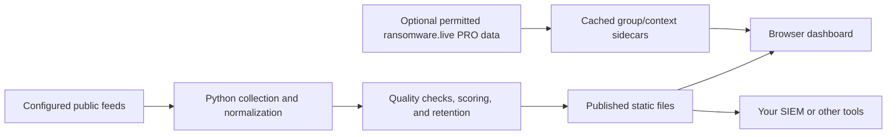

# SwiftIOC

**Collect threat intelligence, keep the evidence attached, and turn a small working set into something you can investigate.**

SwiftIOC is an open-source Python collector and static web dashboard. It gathers indicators of compromise (IOCs) and vulnerability reports from configured sources, normalizes them, publishes downloadable feeds, and gives analysts tools to review the evidence. You can [use the live dashboard](https://harsim.ca/SwiftIOC-Automated-Threat-Intelligence-Collector/) without installing anything or creating an account.

An **IOC** is a value to look for in telemetry, such as an IP address, domain, URL, or file hash. A **CVE** identifies a vulnerability in software. A CVE is not automatically an IOC, and neither kind of record proves that your environment is compromised.

[](https://github.com/PKHarsimran/SwiftIOC-Automated-Threat-Intelligence-Collector/actions/workflows/ci.yml)
[](https://github.com/PKHarsimran/SwiftIOC-Automated-Threat-Intelligence-Collector/actions/workflows/collect.yml)
[](https://github.com/PKHarsimran/SwiftIOC-Automated-Threat-Intelligence-Collector/actions/workflows/codeql.yml)
[](LICENSE)
[](https://harsim.ca/SwiftIOC-Automated-Threat-Intelligence-Collector/diagnostics/run.json)

Badges can be cached; the linked diagnostics give the actual collection time and source status. Counts describe the **retained snapshot**, not a complete upstream catalog.

## Choose your starting point

| I want to… | Start here |
| --- | --- |
| Check an IP, domain, URL, or hash | [IOC lookup](https://harsim.ca/SwiftIOC-Automated-Threat-Intelligence-Collector/#ioc-lookup) → inspect sources and dates → add useful records to the investigation queue. |
| Review exploited vulnerabilities | [CVE workspace](https://harsim.ca/SwiftIOC-Automated-Threat-Intelligence-Collector/#vulnerabilities) → read CISA/NVD evidence → optionally follow a product or compare a local inventory. |
| Research ransomware-group reporting | [Groups](https://harsim.ca/SwiftIOC-Automated-Threat-Intelligence-Collector/groups.html) for reported links; [Workbench](https://harsim.ca/SwiftIOC-Automated-Threat-Intelligence-Collector/ransomware-workbench.html) for triage, coverage, comparison, and response drafts. |
| Use data in another tool | [Feed map](#published-files) and [integration guide](integrations/README.md). |
| Run or change the collector | [Local setup](#run-it-locally) and the [wiki installation guide](https://github.com/PKHarsimran/SwiftIOC-Automated-Threat-Intelligence-Collector/wiki/Installation). |

New to the project? Read the wiki's [How it works](https://github.com/PKHarsimran/SwiftIOC-Automated-Threat-Intelligence-Collector/wiki/How-It-Works) for a record-by-record walkthrough, or use the [wiki home](https://github.com/PKHarsimran/SwiftIOC-Automated-Threat-Intelligence-Collector/wiki) to choose an analyst, maintainer, or developer path.

## How the pieces fit


```mermaid
flowchart LR
  A[Configured public feeds] --> B[Python collection and normalization]
  B --> C[Quality checks, scoring, and retention]
  C --> D[Published static files]
  D --> E[Browser dashboard]
  D --> F[Your SIEM or other tools]
  G[Optional permitted ransomware.live PRO data] --> H[Cached group/context sidecars]
  H --> E
```

1. **Collect.** YAML configuration selects feeds and parsers. The collector fetches them, records source failures, normalizes values, filters configured false positives, and merges identical `(type, indicator)` records while retaining provenance.
2. **Decide what to publish.** Quality gates can reject a bad collection without replacing the previous feed. With `--persist-feed`, prior records can carry forward, age, and be rescored. Score and retention settings bound the published set.
3. **Write files.** The collector produces separate observable and CVE collections, compatibility feeds, a one-run change feed, detection drafts, and diagnostics. GitHub Actions normally collects every four hours and deploys the resulting `public/` tree. A schedule is not a freshness guarantee; check [run diagnostics](https://harsim.ca/SwiftIOC-Automated-Threat-Intelligence-Collector/diagnostics/summary.html).
4. **Investigate in the browser.** The site fetches published files. It does not need a Python API server or an account. Lookup, filters, graph pivots, workbench tools, SPL generation, and local inventory comparison do not call upstream providers on each click.

The same CVE may contain separate CISA KEV and NVD reports. Different CVE IDs remain different records even when they name the same product. Publisher-group counts and scores help order review; they are **not** proof of independent corroboration, attack attribution, or compromise. Shipped aliases from one publisher count once, and aggregate/context lists add no corroboration bonus.

## What the site helps you do

| Area | What it does | What it does **not** do |
| --- | --- | --- |
| **IOC feed and lookup** | Find raw or defanged values; inspect score, tags, source IDs, and dates; create a browser-local investigation queue. | A match is not a verified malicious event in your logs. |
| **Workspace and SPL** | Turn up to 50 selected observables into configurable Splunk search text or portable exports. `index=*`, wildcard, and comma-separated index scopes are supported. | It does not execute a search or know your field mappings; review cost and query semantics before running it. |
| **CVE workspace and Today** | Review exploitation evidence, official CVE details, EPSS forecasts, product watches, material changes, group associations, and a hypothetical patch scenario. | EPSS is not known exploitation or a local risk score; the site does not scan hosts or prove affected versions. |
| **Local exposure report** | Compare an imported asset list with retained CISA product evidence and supported NVD applicability rules. | Product or version matches still need vendor/scanner verification. Inventory stays in the current tab. |
| **SBOM review** | Import CycloneDX or SPDX JSON and optionally query exact package versions against OSV. | The SBOM stays in the tab until you explicitly send package IDs/versions to OSV; no match does not mean safe. |
| **Groups and Workbench** | Explore permitted ransomware.live associations, IOC research candidates, coverage gaps, MITRE detection guidance, and draft response packs. | Group links do not prove current use, attribution, local exposure, or a shared campaign. |

The browser keeps queue and watch preferences locally when storage is available. Export work you need to keep or share. Imported inventory is held in tab memory, not uploaded or saved to browser storage; exported scenarios may contain asset IDs, so review them before sharing.

## Run it locally

You need Git and **Python 3.10+**. Browsing the [hosted site](https://harsim.ca/SwiftIOC-Automated-Threat-Intelligence-Collector/) needs neither. These commands collect your own snapshot and then serve the existing frontend over HTTP.

### macOS or Linux

```bash
git clone https://github.com/PKHarsimran/SwiftIOC-Automated-Threat-Intelligence-Collector.git
cd SwiftIOC-Automated-Threat-Intelligence-Collector
python3 -m venv .venv
source .venv/bin/activate
python -m pip install -e .
cp sources.example.yml sources.yml
python -m swiftioc --self-test
python -m swiftioc --sources sources.yml --out-dir public --persist-feed --max-age-days 30 --max-store 10000
python -m http.server 8765 --directory public
```

### Windows PowerShell

```powershell
git clone https://github.com/PKHarsimran/SwiftIOC-Automated-Threat-Intelligence-Collector.git
Set-Location SwiftIOC-Automated-Threat-Intelligence-Collector
py -3 -m venv .venv
.\.venv\Scripts\python.exe -m pip install -e .
Copy-Item sources.example.yml sources.yml
.\.venv\Scripts\python.exe -m swiftioc --self-test
.\.venv\Scripts\python.exe -m swiftioc --sources sources.yml --out-dir public --persist-feed --max-age-days 30 --max-store 10000
.\.venv\Scripts\python.exe -m http.server 8765 --directory public
```

Open [http://localhost:8765](http://localhost:8765). The collection step makes network requests and can take time; the self-test does not. Generated `public/collections/` files may be absent from a fresh clone until collection runs. Do not open `index.html` directly as a local file. Read `public/diagnostics/REPORT.md` and `public/diagnostics/run.json` if data is missing. For Docker, fork deployment, and detailed recovery steps, use [Installation](https://github.com/PKHarsimran/SwiftIOC-Automated-Threat-Intelligence-Collector/wiki/Installation) and [Operations](https://github.com/PKHarsimran/SwiftIOC-Automated-Threat-Intelligence-Collector/wiki/Operations-and-Troubleshooting).

## Published files

The paths below are relative to `public/` locally or the [published site](https://harsim.ca/SwiftIOC-Automated-Threat-Intelligence-Collector/). The compact dashboard preview is **not** the full retained feed.

| Path | Use |
| --- | --- |
| [`collections/observables.jsonl`](https://harsim.ca/SwiftIOC-Automated-Threat-Intelligence-Collector/collections/observables.jsonl) | Non-CVE values for telemetry matching. |
| [`collections/vulnerabilities.json`](https://harsim.ca/SwiftIOC-Automated-Threat-Intelligence-Collector/collections/vulnerabilities.json) | One retained record per CVE, with separate provider reports. |
| [`iocs/latest.jsonl`](https://harsim.ca/SwiftIOC-Automated-Threat-Intelligence-Collector/iocs/latest.jsonl) | Full retained compatibility snapshot, including CVEs. CSV/TSV/JSON variants are also written. |
| [`iocs/delta.json`](https://harsim.ca/SwiftIOC-Automated-Threat-Intelligence-Collector/iocs/delta.json) | Changes against the last validated snapshot; one collection interval, not a permanent event queue. |
| [`iocs/high_confidence.jsonl`](https://harsim.ca/SwiftIOC-Automated-Threat-Intelligence-Collector/iocs/high_confidence.jsonl) | Score-threshold or multi-source subset for review, not automatic blocking. |
| [`group_evidence.json`](https://harsim.ca/SwiftIOC-Automated-Threat-Intelligence-Collector/group_evidence.json) / [`ransomware_context.json`](https://harsim.ca/SwiftIOC-Automated-Threat-Intelligence-Collector/ransomware_context.json) | Derived group associations and aggregate context when permitted PRO enrichment is configured. |
| [`cve_signals.json`](https://harsim.ca/SwiftIOC-Automated-Threat-Intelligence-Collector/cve_signals.json) | Cached daily FIRST EPSS lookup for retained/group CVEs and bounded official CVE/CISA SSVC details for group-linked CVEs. No PRO calls. |
| [`attack_guidance.json`](https://harsim.ca/SwiftIOC-Automated-Threat-Intelligence-Collector/attack_guidance.json) | Bounded MITRE ATT&CK technique-to-detection-strategy and analytic references, refreshed at most weekly. No PRO calls. |
| `detections/`, `misp/`, `iocs/stix2.json`, `feed.xml` | Draft detections and interoperability outputs; validate before deployment. |
| [`diagnostics/run.json`](https://harsim.ca/SwiftIOC-Automated-Threat-Intelligence-Collector/diagnostics/run.json) / `diagnostics/collection-attempt.json` | Published run and latest quality-check attempt; compare timestamps and status. |

Start with a full snapshot, then consume Delta only while its previous-generation checkpoint matches yours. If you miss an interval, reconcile with the full snapshot. `removed_from_feed` means absent from SwiftIOC's retained set, **not** benign. See [SPL and integrations](https://github.com/PKHarsimran/SwiftIOC-Automated-Threat-Intelligence-Collector/wiki/SPL-and-Integrations), [Detection packs](https://github.com/PKHarsimran/SwiftIOC-Automated-Threat-Intelligence-Collector/wiki/Detection-Packs), and the [complete output map](https://github.com/PKHarsimran/SwiftIOC-Automated-Threat-Intelligence-Collector/wiki/Reference-and-Glossary).

## Optional ransomware.live enrichment

The core collector and site work without a PRO key. If you have permission to use and publish derived ransomware.live data, store the key in the repository secret `RANSOMWARE_LIVE_API_KEY`; never place it in source files or browser code. The collector caches provider responses for at least 24 hours, rechecks SwiftIOC membership between provider refreshes, and publishes only normalized associations and aggregate context. Browser views use those static sidecars and make **zero PRO API calls**. The group collector also has a hard cap on groups to prevent an unexpectedly large request burst.

Provider associations are research leads. Unmatched provider IOCs are labeled **research candidates**, not silently added to scores or blocklists. See [Ransomware intelligence](https://github.com/PKHarsimran/SwiftIOC-Automated-Threat-Intelligence-Collector/wiki/Ransomware-Intelligence) for data flow, call-budget behavior, UI meanings, and limitations.

The Workbench shows exact feed overlap and explicitly labels groups for which no IOC collection is available. Analysts can record local “observed in my logs” or dismissal decisions; completed items leave the default queue but remain reviewable. Per-IOC/CVE evidence cases can be exported and reopened against a later snapshot. These local actions never change the public feed or prove group attribution. The separate EPSS, CVE, and ATT&CK sidecars use public sources and consume **zero ransomware.live PRO calls**.

## Trust and project boundaries

- A high score ranks review relevance, not a probability of maliciousness. Multiple source IDs may come from one provider; graph aliases do not change the score.
- CISA KEV is evidence of known exploitation, not evidence that your asset is exposed. NVD applicability data can be incomplete or conditional.
- A missing record, empty search, or removed Delta event does not prove safety. The retained feed is bounded by lookback, filtering, decay, and capacity.
- Detection files and SPL are drafts. Validate mappings, syntax, false positives, cost, and local policy before use.
- Provider terms and attribution still apply. See [Security and privacy](https://github.com/PKHarsimran/SwiftIOC-Automated-Threat-Intelligence-Collector/wiki/Security-and-Privacy) and [SECURITY.md](SECURITY.md).

## Documentation and development

The [wiki](https://github.com/PKHarsimran/SwiftIOC-Automated-Threat-Intelligence-Collector/wiki) is the detailed handbook: [How it works](https://github.com/PKHarsimran/SwiftIOC-Automated-Threat-Intelligence-Collector/wiki/How-It-Works), [Analyst workflow](https://github.com/PKHarsimran/SwiftIOC-Automated-Threat-Intelligence-Collector/wiki/Analyst-Workflow), [CVE and exposure](https://github.com/PKHarsimran/SwiftIOC-Automated-Threat-Intelligence-Collector/wiki/CVE-and-Exposure), [Ransomware intelligence](https://github.com/PKHarsimran/SwiftIOC-Automated-Threat-Intelligence-Collector/wiki/Ransomware-Intelligence), [Operations](https://github.com/PKHarsimran/SwiftIOC-Automated-Threat-Intelligence-Collector/wiki/Operations-and-Troubleshooting), and the [CLI/glossary](https://github.com/PKHarsimran/SwiftIOC-Automated-Threat-Intelligence-Collector/wiki/Reference-and-Glossary). Reviewable wiki source copies live in [`docs/wiki/`](docs/wiki/); the GitHub wiki is a separate repository and must also be published when those files change.

The Python code is in [`swiftioc/`](swiftioc/), the static site and generated files are in [`public/`](public/), and offline tests are in [`tests/`](tests/). Run `python -m swiftioc --help` for current CLI flags. To check a development environment:

```bash
python -m pip install -r requirements-dev.txt
python -m swiftioc --self-test
python -m pytest -q
node --test public/assets/dashboard-core.test.js public/assets/inventory-core.test.js public/assets/group-intel-core.test.js public/assets/ransomware-workbench-core.test.js public/assets/today-core.test.js
```

Browser tests use Playwright with synthetic snapshots; see [Development and testing](https://github.com/PKHarsimran/SwiftIOC-Automated-Threat-Intelligence-Collector/wiki/Development-and-Testing). Read [CONTRIBUTING.md](CONTRIBUTING.md) before contributing. SwiftIOC is MIT-licensed; upstream feed rights remain with their providers.
