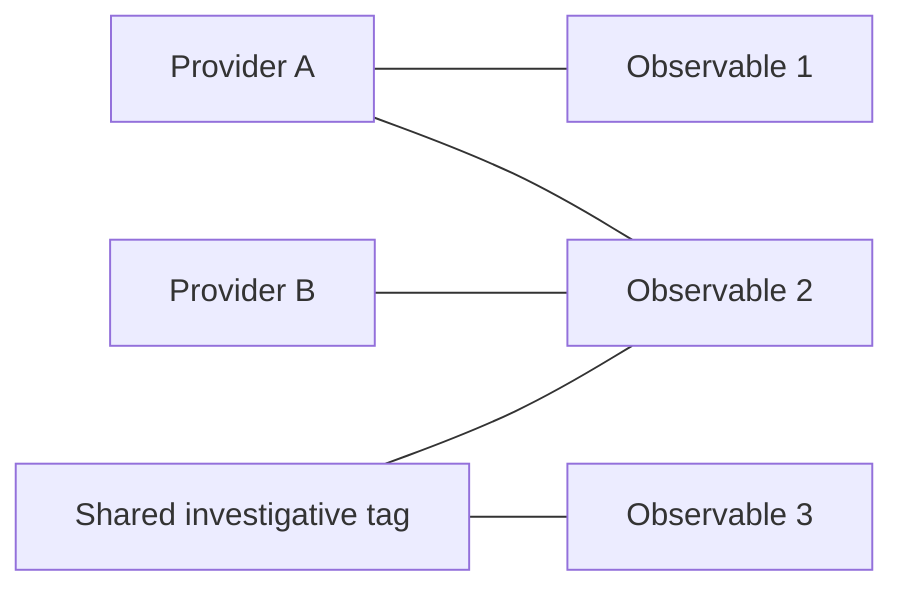

# Read the graph as evidence

The graph connects observable indicators to reporting-provider and tag pivots. It makes shared evidence visible without claiming that every cluster is a real campaign.

In this illustrative graph, Observable 2 is reported by two providers and shares a tag with Observable 3. That justifies investigating a relationship. It does not prove shared infrastructure ownership, causality or attribution to a threat actor.

## Provider names must mean something

Raw names such as `threatfox_export_json` describe ingestion adapters. Both dashboard provenance and collector scoring group shipped aliases into reporting publishers. Multiple abuse.ch exports count as one reporting group; aggregate/context feeds add no corroboration bonus. Unknown custom feeds remain distinct names until mapped, not verified independent observers.

The graph and Python scorer use the same shipped publisher families, but raw source names remain available for audit. Neither view proves that distinct publishers observed an indicator independently. Known feed-name tags, including aliases such as ThreatFox and CINS, are excluded from uncommon-tag investigative leads.

## Explore a cluster

1. Start with the preview's filters so the graph answers a focused question.
2. Switch between provider/source, tag or combined relationships.
3. Choose 24, 36 or 48 indicators; phones begin with the smaller view. Switch between the compact constellation and evidence lanes without changing the underlying links.
4. Use a suggested connection or search, then hover or focus a node to preview its direct links. Select it to pin the neighborhood and inspect evidence. **Focus links** temporarily hides unrelated nodes and edges, updates the visible-sample counters, and centers that neighborhood; **Show all links** restores the full display. Hidden links are not removed from the data.
5. Zoom in, drag empty map space to pan, or use Fit to reset the view. Curved links in the constellation make routes easier to follow; curvature does not imply relationship strength.
6. Add a useful IOC to Workspace or export the displayed evidence/neighborhood.
7. Click empty graph space or press Escape to reset selection.

Arrow keys move between nodes; Home/End jump; Enter/Space select. Search refangs IOC labels and queries, so an ordinary IP can match `[.]` display spelling and an HTTP URL can match `hxxp`. Provider/tag matching retains its literal meaning.

## Boundaries keep the view usable

Rendering is bounded to at most **48 indicators and eight pivots**. Singleton pivots are excluded, and counters should include only pivots represented by selected edges. The displayed sample can omit real relationships. Graph size is not the full feed size, and visible high-risk counts describe the sample.

Layout changes, rotation and zoom change presentation, not evidence. The constellation spaces bounded nodes deterministically rather than using a free-running physics animation. Node selection, highlighting and the inspector should remain consistent through filter, density and refresh changes. Motion respects reduced-motion preferences in the dashboard.

## Discovery lenses

| Lens | What it surfaces | What it does not establish |
| --- | --- | --- |
| Cross-group | At least two distinct reporting groups in the loaded preview, with raw feed names shown separately; up to six ranked leads. Known aliases from one publisher count once, while aggregate and context feeds do not add a group. | Verified independent observation by those publishers. Unmapped custom feed names retain separate identities until mapped. |
| Recent sightings | Valid last-seen time within 24 hours; future times excluded. | A new attack or first discovery. |
| Uncommon tags | Nongeneric investigative tags on at most three distinct indicators in the filtered sample. | Global rarity across the internet or all retained feeds. |

Filtered or unavailable data updates the graph and discovery desk together. Failed refreshes should clear actionable findings and disable exports rather than retaining a misleading selection.

**Further detail:** [graph design](https://github.com/PKHarsimran/SwiftIOC-Automated-Threat-Intelligence-Collector/blob/main/docs/THREAT_CAMPAIGN_GRAPH.md), [browser core](https://github.com/PKHarsimran/SwiftIOC-Automated-Threat-Intelligence-Collector/blob/main/public/assets/dashboard-core.js).

---
[Wiki home](https://github.com/PKHarsimran/SwiftIOC-Automated-Threat-Intelligence-Collector/wiki) · [Interview guide](https://github.com/PKHarsimran/SwiftIOC-Automated-Threat-Intelligence-Collector/wiki/Interview-Guide) · [Documentation map](https://github.com/PKHarsimran/SwiftIOC-Automated-Threat-Intelligence-Collector/wiki/Reference-and-Glossary)

*For current feed counts and timestamps, check the published diagnostics.*
