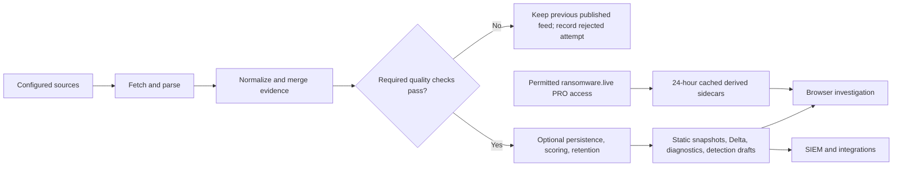

# How SwiftIOC works, end to end

SwiftIOC has a **producer** (the Python collector) and a **consumer** (the static website or your security tool). They communicate through published files. There is no per-visitor Python API or database account. The optional, explicitly initiated SBOM check is an exception: your browser contacts OSV.dev directly with selected package identities and versions.

## Follow one record

Imagine two configured sources report the same IP address. Their adapters turn the different responses into a common record. Normalization gives both the same `(type, indicator)` identity, and deduplication joins their source IDs, context, and observation dates. If persistence is enabled, an older retained copy can preserve the first observation and age when the IP is not re-reported. The collector calculates a relevance score, applies the configured age/score/cap limits, and writes the result to a snapshot. The browser can then show the evidence and let an analyst put the IP into a local investigation queue.

That sequence does **not** establish that the sources are independent, that the IP was used in an attack on your network, or that it should be blocked. Scores rank review; [Data and scoring](https://github.com/PKHarsimran/SwiftIOC-Automated-Threat-Intelligence-Collector/wiki/Data-and-Scoring) explains the formula and retention choices.

A CVE follows a different analyst path. Reports for the **same CVE ID** can retain separate CISA KEV and NVD evidence. The CVE workspace explains exploitation and severity separately. An imported inventory can compare product/version information with available applicability rules, but SwiftIOC does not inspect installed software. Different CVE IDs are never merged merely because they mention the same product. See [CVE and exposure](https://github.com/PKHarsimran/SwiftIOC-Automated-Threat-Intelligence-Collector/wiki/CVE-and-Exposure).

## What happens during collection

| Stage | Input → output | Why it matters |
| --- | --- | --- |
| Configure | `sources.yml` (or `sources.example.yml`) → source jobs | Each adapter has its own format, lookback, and terms. API keys come from environment variables or Actions secrets, not committed YAML. |
| Fetch and parse | HTTP/RSS responses → typed records | Diagnostics retain errors and source volumes. A successful run can still have optional source failures. |
| Normalize and filter | Typed records → deduplicated evidence | Values are classified and normalized; configured false positives are filtered and duplicate identities are merged. |
| Quality gate | Source counts/timestamps and previous diagnostics → accept or reject | Required-source checks run before feed replacement. A rejection writes `diagnostics/collection-attempt.json` and leaves the prior published feed/baseline intact. |
| Protect publication | Accepted evidence, including a prior snapshot → sanitized inputs | Recognizable credential-shaped collected records are omitted before exports and Delta can republish them. This is targeted filtering, not a comprehensive secret scanner. |
| Maintain | Accepted records + optional prior snapshot → bounded retained set | `--persist-feed` carries history; decay, minimum score, optional age limit, and capacity decide what remains. |
| Publish | Retained set → files in `public/` | Separate observable/CVE collections, compatibility formats, one-interval Delta, diagnostics, and draft detections serve both people and tools. Individual writes are atomic, but the directory is not one transaction. |

The production [collection workflow](https://github.com/PKHarsimran/SwiftIOC-Automated-Threat-Intelligence-Collector/actions/workflows/collect.yml) is scheduled every four hours, runs the collector, verifies generated detection files, and deploys a Pages artifact. The current production flags enable persistence, 30-day maximum age, and a 10,000-record cap. These are deployment choices, not defaults for every local run or a promise that all upstream catalogs are included. Scheduled jobs may be delayed; inspect the [published diagnostics](https://harsim.ca/SwiftIOC-Automated-Threat-Intelligence-Collector/diagnostics/summary.html).

## What the browser reads—and stores

| Browser area | Published input | Browser-only state |
| --- | --- | --- |
| IOC lookup, feed, graph, discovery | `iocs/dashboard.jsonl`, source/run summaries, and related static outputs | Filters and a local investigation queue. |
| CVE workspace and Today | `collections/vulnerabilities.json` plus group evidence when available | Product watches, review state, material-change baseline, and temporary patch scenarios. |
| Exposure report | Retained CVE collection | Imported inventory in **current-tab memory**; it is not uploaded or saved to local storage. |
| SBOM review | Local CycloneDX/SPDX JSON; OSV only after explicit check | SBOM in **current-tab memory**; package URLs/versions sent directly to OSV.dev only on request. |
| Groups and Ransomware Workbench | `group_evidence.json`, `ransomware_context.json`, and `attack_guidance.json` | Group/telemetry/watch and candidate-decision preferences in the browser when storage is available. |
| Public CVE signals | `cve_signals.json` | Daily EPSS and bounded official CVE/CISA SSVC detail, kept separate from KEV/NVD/group claims. |

The site generates SPL and other exports locally. It does not run searches in your SIEM. Some exports can contain your selected indicators or asset IDs; inspect them before sharing. Local preferences do not synchronize between devices or survive blocked/cleared browser storage.

## How optional ransomware data fits

With permitted PRO access, a separate collection step derives group–IOC–CVE–technique associations and aggregate activity context. These are **sidecars**, not a rewrite of the core feed. Provider responses are cached for 24 hours; ordinary browser activity makes no PRO calls. Between provider refreshes, SwiftIOC can recheck exact matches against its own newest feed. A group association is a research lead, not proof of current exploitation, local exposure, or actor attribution. Unmatched provider IOCs remain research candidates. Details and call-budget safeguards are in [Ransomware intelligence](https://github.com/PKHarsimran/SwiftIOC-Automated-Threat-Intelligence-Collector/wiki/Ransomware-Intelligence).

## What can go wrong

- **The website loads but data is old.** Static availability and feed freshness are different. Compare source times, run diagnostics, and the Actions run.
- **A required source fails.** The attempted collection is reported separately; the prior published feed is retained rather than silently replaced with a bad snapshot.
- **A source succeeds but a format changes.** Diagnostics can show HTTP success with zero parsed records. Validate parser output before changing quality thresholds.
- **The browser finds no match.** Retention, lookback, source coverage, and data freshness limit the snapshot. No match is not a safety verdict.
- **A downstream consumer misses a Delta.** Delta covers one collection interval. Reconcile with the full snapshot instead of assuming continuity.

For setup, read [Installation](https://github.com/PKHarsimran/SwiftIOC-Automated-Threat-Intelligence-Collector/wiki/Installation). For deeper code ownership and publication boundaries, read [Architecture](https://github.com/PKHarsimran/SwiftIOC-Automated-Threat-Intelligence-Collector/wiki/Architecture). For failures and recovery, read [Operations](https://github.com/PKHarsimran/SwiftIOC-Automated-Threat-Intelligence-Collector/wiki/Operations-and-Troubleshooting).
