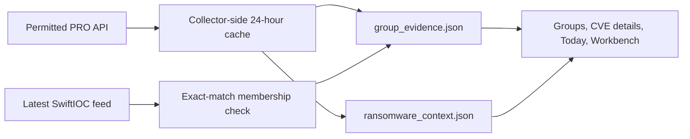

# Ransomware intelligence: what is reported, not what is proven

SwiftIOC can add **optional** ransomware.live PRO context when the project has permission to use and publish derived data. The core IOC/CVE collector does not require this key. The provider's group associations are kept separate from CISA exploitation evidence, NVD product applicability, and SwiftIOC's own retained feed.

## The data path and API budget

Set `RANSOMWARE_LIVE_API_KEY` as a GitHub Actions repository secret or a local environment variable. Never put its value in committed YAML, a frontend file, a URL, or a wiki page. Confirm the provider permission covers publication of the derived sidecars and keep source attribution.

The group collector reads group profiles and IOC collections, normalizes IOC/CVE/ATT&CK values, and writes `group_evidence.json`. It first checks `/groups` and the IOC-group index so it can skip IOC endpoints for groups without a collection. It refuses an empty or unexpectedly large group listing; the hard cap is 500 groups and no more than 1,002 requests in one full group refresh. The separate context collector reads seven documented PRO endpoints and publishes **aggregate counts and availability**, not raw responses, in `ransomware_context.json`.

Both sidecars have a 24-hour provider refresh interval. A scheduled four-hour collection inside that window reuses the provider snapshot with **zero PRO calls** for that sidecar; group membership against SwiftIOC's latest feed can still be rechecked. A full refresh uses calls, so do not use `--force-refresh` routinely. If the key is absent or an API call fails, the core feed still runs and the previous good sidecar is retained when available. Check the collection log and sidecar `generated_at` instead of assuming the browser view is live provider data.

The browser fetches only published JSON. Searching, filtering, graphing, and building draft response packs make **no PRO API calls**. This is why adding more browser views does not consume the provider quota.

The Workbench's candidate view lists group-reported IOCs without an exact retained-feed match. Network IOCs awaiting review appear first; file hashes and all types remain available through the filter. Locally observed and dismissed decisions leave the default queue but remain available under **Candidate status**. The queue shows scoped coverage counts and expandable collection receipts. A decision can be exported, but does not promote an IOC into the published feed or validate attribution. A group with no available IOC collection is **unknown coverage**, not proof that the group has no IOCs. The page shows more records in bounded batches instead of hiding everything beyond the first 30.

Each IOC or CVE in Priorities can also be exported as a self-contained evidence case: selected value and group associations, provider collection receipts, score reasons, snapshot timestamps, a local analyst decision when present, and a draft IOC hunt or cached public CVE signal when available. **Open an exported evidence case** compares its saved association with the current group snapshot without changing local decisions. The case timestamp is not yet a cryptographic publication-generation identity; treat a saved case as a review artifact, not a signed record.

Separate public-source sidecars add CVE signals and detection guidance: `cve_signals.json` uses FIRST's daily EPSS CSV and bounded official CVE lookups; `attack_guidance.json` uses MITRE ATT&CK STIX at most weekly to connect group-level techniques with published detection strategies, analytics, platforms, and log-source examples. Neither sidecar calls ransomware.live. These sources describe different claims and should not be treated as independent confirmation of a named-group association.

## Interpret a group association

| Label or field | Meaning | What it cannot establish |
| --- | --- | --- |
| **Reported group** | The provider associates a group with a CVE, IOC, or group-level technique. | That the group is using it now, that your organization is targeted, or that two groups collaborate. |
| **In SwiftIOC** | An exact type/value match exists in SwiftIOC's retained feed. | Independent corroboration; the two datasets may share upstream reporting. |
| **Research candidate** | Provider evidence has no exact retained-feed match. | That the record is malicious enough for scoring or blocking. It is not auto-promoted. |
| **First observed locally / last local check** | When SwiftIOC first recorded or last checked an association. | The date of exploitation or an incident. |
| **ATT&CK technique** | Reported group-level behavior. | That every IOC linked to the group demonstrates that technique. |

For CVEs, CISA KEV says exploitation is known in general; ransomware.live supplies a **named-group association**; NVD supplies severity/applicability data. Those are different claims. The CVE detail drawer keeps them separate, and multiple reports about a CVE do not by themselves confirm a named-group claim.

## Choose the right page

| Question | Page and action |
| --- | --- |
| “What has this group been reported with?” | [Groups](https://harsim.ca/SwiftIOC-Automated-Threat-Intelligence-Collector/groups.html): choose a group, then inspect CVEs, IOCs, techniques, receipts, and the evidence map. |
| “Did a reported CVE also appear in the retained vulnerability collection?” | Follow **Review CVE** to the [CVE workspace](https://harsim.ca/SwiftIOC-Automated-Threat-Intelligence-Collector/#vulnerabilities) and compare provider reports. |
| “What changed since SwiftIOC last checked?” | Groups → **Changes**. A baseline on first collection avoids calling every old association new. Removals mean absent from the snapshot, not safe. |
| “What should I review or hunt next?” | [Workbench](https://harsim.ca/SwiftIOC-Automated-Threat-Intelligence-Collector/ransomware-workbench.html) → Priorities, Triage, Coverage, or Compare. Scores order review and similarity describes overlap; neither is attribution confidence. |
| “Does my evidence list have an exact association?” | Workbench → Exposure or Watchlist. Inputs stay in the browser; product/version applicability belongs in the dashboard's separate inventory report. |
| “What can I take into my own tools?” | Groups → Hunt pack or Workbench → response pack. Review generated SPL/KQL/Sigma/Suricata mappings, cost, IDs, and false positives before use. Nothing runs automatically. |

### Read the group evidence map

In **Groups → Evidence map**, choose CVEs, IOCs, or ATT&CK techniques. The map draws direct reported group-to-record links, with distinct styling for exact SwiftIOC feed matches and research candidates; techniques are labeled as group-level behavior rather than feed candidates. The summary cards show how much of the snapshot is mapped, exact feed matches or other mapped groups, and either shared records or direct technique links. Click a record for a structured evidence card with local tracking dates and mapped groups, or click a group to pivot. Selected CVEs may also show a short product/description excerpt from the separately published official CVE signal file. That context does not validate the named-group report or determine whether your assets are affected. Switch between evidence lanes and a constellation, drag to pan or untangle nodes, and use the zoom/fit controls. On small screens the map opens near the selected record; pan to explore the rest.

The view intentionally shows at most 12 records and 10 other groups at once. Its status line gives the full totals; search can bring a specific record outside the initial sample into the map. Dense maps show focus-group and selected-record links by default; hover a node to trace its links or turn on **All links**. **Export map data** writes all direct links among the currently displayed nodes, even if some lines are visually hidden to reduce clutter, with snapshot and scope labels. The expandable connection list supports reading the same displayed evidence without the canvas. Visual distance, shared records, and line crossings are not scores or evidence that groups collaborate. The graph is rendered locally from the published snapshot, so interacting with it uses no additional PRO calls.

The workbench radar is an **aggregate reporting sample**, not a prevalence estimate or forecast. `ransomware_context.json` does not publish victim names, victim domains, screenshots, press records, ransom notes, negotiation chats, or raw API responses. Country/sector watches are context only; they do not infer CVE applicability for a user's assets.

## What stays private

Workbench telemetry choices and watchlists use browser storage when available. Exposure-check text is processed in page memory and is not uploaded or saved. The dashboard inventory report also uses current-tab memory. Exported packs or scenarios can contain selected IOCs, CVEs, or asset IDs; inspect files before sharing them. Clearing browser data removes local watches and review state.

Next: [How SwiftIOC works](https://github.com/PKHarsimran/SwiftIOC-Automated-Threat-Intelligence-Collector/wiki/How-It-Works), [CVE and exposure](https://github.com/PKHarsimran/SwiftIOC-Automated-Threat-Intelligence-Collector/wiki/CVE-and-Exposure), [Security and privacy](https://github.com/PKHarsimran/SwiftIOC-Automated-Threat-Intelligence-Collector/wiki/Security-and-Privacy), and [Operations](https://github.com/PKHarsimran/SwiftIOC-Automated-Threat-Intelligence-Collector/wiki/Operations-and-Troubleshooting).
