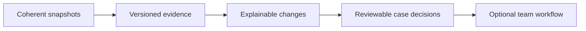

# Improve the product with measurable outcomes

These are prioritized improvements, including bounded first versions now shipped and larger work still proposed. Prioritize reliability and analyst trust before expanding the interface. A small product with clear evidence and dependable recovery is more credible than a broad dashboard with unclear claims.

## Recommended order

| Priority | Improvement | Status / remaining acceptance evidence |
| --- | --- | --- |
| 1 | Immutable publication generations and one current-manifest pointer | Proposed. Interrupt publication at each write; readers must keep a coherent prior/current generation, including signatures. |
| 2 | Feed contracts and explicit partial-coverage state | First version distinguishes failed, empty and cap-truncated sources in diagnostics and site health. Upstream pagination completeness and source-specific freshness still need explicit contracts and fixtures. |
| 3 | Provider-aware provenance in ranking | Bundled adapter aliases now count by publisher; aggregate/context lists add no bonus. Still measure score/rank changes and support explicit mappings for custom feeds. |
| 4 | Measured frontend performance budgets | Proposed. Publish benchmark fixture, hardware/browser context, p50/p95 duration and main-thread blocking time. |
| 5 | Evidence-linked case export | First version shipped for IOC/CVE priority cards, with local reopen and current-snapshot comparison. Immutable generation identity and full case-change history remain open. |
| 6 | Optional collaborative backend | Proposed only. Requires role, retention, privacy, migration and backup/recovery decisions before implementation. |

## A distinctive product direction

The current **Today briefing** already combines product/group watches, inventory relevance and material CVE evidence changes in a local browser view. A more ambitious **case-linked evidence-change briefing** could connect a changed provider claim to the exact asset finding, prior analyst decision and next verification step. That would go beyond today's local suggestions and exported scenarios.

That requires reliable generation identity, evidence versioning and explicit uncertainty first. Treat this as a direction to validate with analysts, not a claim that the feature is unique in the market.

## Tradeoffs worth keeping visible

| Current choice | Benefit | Cost / trigger for change |
| --- | --- | --- |
| Static files | Simple hosting and offline-friendly exports. | Snapshot latency; change when coherent incremental/live needs are measured. |
| Browser-local workspace | No account setup or upload of inventory. | No cross-device/team state; add backend only with clear privacy/access design. |
| Bounded graph and retained feed | Predictable payload/render size. | Incomplete coverage; expose limits rather than hiding them. |
| Heuristic score | Understandable factors and cheap computation. | Not calibrated likelihood; measure usefulness with analyst feedback. |
| Conservative applicability | Avoid unsupported “vulnerable” verdicts. | More manual review; improve evidence coverage before stronger claims. |

## Metrics to collect before promising commercial readiness

Track successful-source coverage, snapshot age, partial collection frequency, quality rejections, publication consistency, detection verification failures, investigation task completion and query false-positive/false-negative behavior on known fixtures. Add accessible keyboard and mobile task checks. Describe test hardware, data distribution and sample size with any performance number.

Commercial readiness also involves licensing/terms, support ownership, documented recovery, authorization and auditability. None of those is established by a visual redesign alone.

---
[Wiki home](https://github.com/PKHarsimran/SwiftIOC-Automated-Threat-Intelligence-Collector/wiki) · [Interview guide](https://github.com/PKHarsimran/SwiftIOC-Automated-Threat-Intelligence-Collector/wiki/Interview-Guide) · [Documentation map](https://github.com/PKHarsimran/SwiftIOC-Automated-Threat-Intelligence-Collector/wiki/Reference-and-Glossary)

*For current feed counts and timestamps, check the published diagnostics.*
